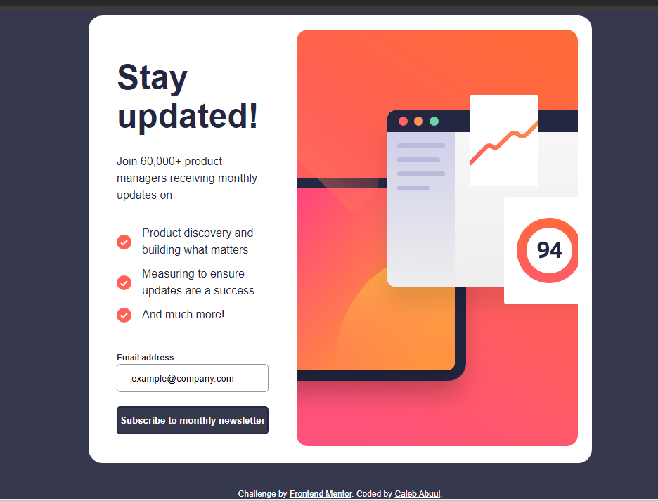
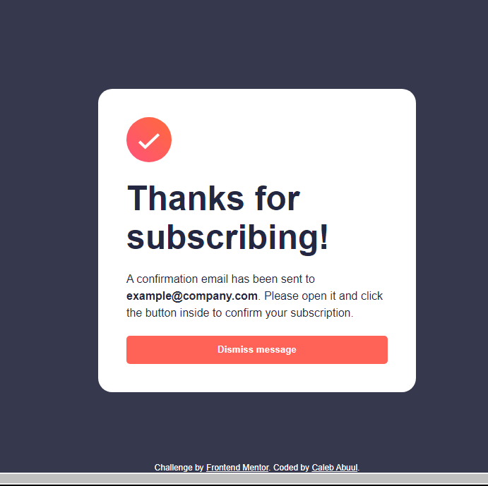
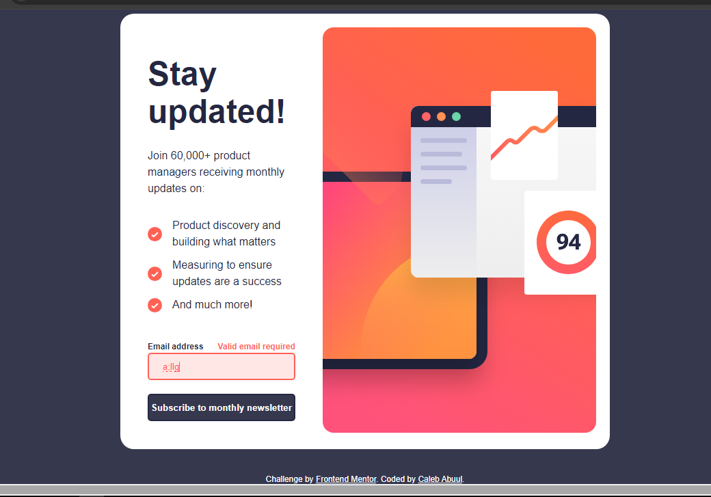
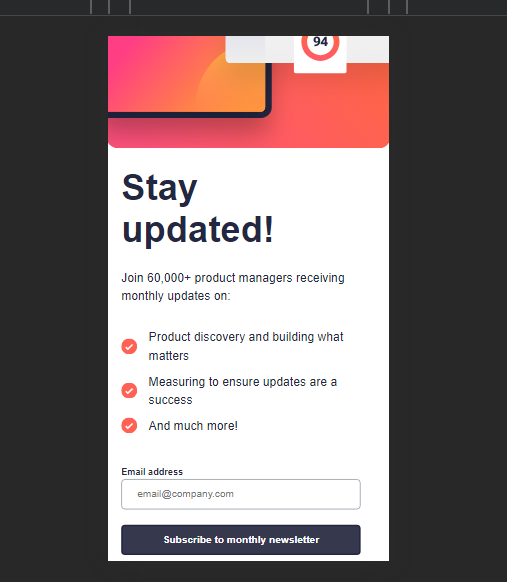
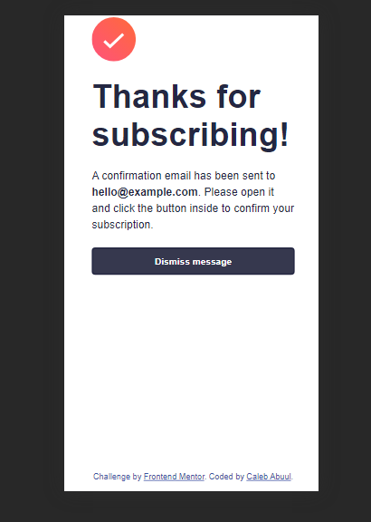
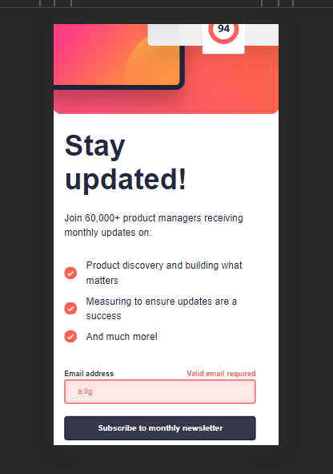

# Frontend Mentor - Newsletter sign-up form with success message solution

This is a solution to the [Newsletter sign-up form with success message challenge on Frontend Mentor](https://www.frontendmentor.io/challenges/newsletter-signup-form-with-success-message-3FC1AZbNrv). Frontend Mentor challenges help you improve your coding skills by building realistic projects.

## Table of contents

- [Overview](#overview)
  - [The challenge](#the-challenge)
  - [Screenshot](#screenshot)
  - [Links](#links)
- [My process](#my-process)
  - [Built with](#built-with)
  - [What I learned](#what-i-learned)
  - [Continued development](#continued-development)
  - [Useful resources](#useful-resources)
- [Author](#author)
- [Acknowledgments](#acknowledgments)

## Overview

### The challenge

Users should be able to:

- Add their email and submit the form
- See a success message with their email after successfully submitting the form
- See form validation messages if:
  - The field is left empty
  - The email address is not formatted correctly
- View the optimal layout for the interface depending on their device's screen size
- See hover and focus states for all interactive elements on the page

### Screenshot

#### Desktop



#### Desktop - success state



#### Desktop - failed state



#### Mobile



#### Mobile - success state



#### Mobile - failed state



### Links

- Solution URL: [Add solution URL here]()
- Live Site URL: [Frontend-mentor_newsletter](https://caleb-abuul.github.io/Frontend-mentor_newsletter/)

## My process

### Built with

- Semantic HTML5 markup
- CSS custom properties
- Flexbox
- CSS Grid
- Mobile-first workflow

### What I learned

I learnt form validation using `HTML`, `CSS` and `JavaScript`. I disabled browser auto-validation using the `novalidate` form attribute. Then I went on to use `JavaScript` to create a form `validate()` function that handled the form validation as desired. It was fun I'd say 😄

another fun and simple thing I learnt was creating a function that creates `JavaScript` variables by passing in an `id`. This made my code lean and clean. 👍

```html
<form novalidate>
  <input type='email' id='email'>
  <button type="submit">Submit</button>
</h1>
```

Using the CSS `min()` function made things a bit easier by resizing the element's width based on screensize. So 🆒!

```css
.container {
  width: min(600px, 100%);
}
```

creating custom functions to handle repetitive tasks such as getting an element by id saved me a lot of time and space.

```js
let id = (id) => document.getElementById(id);

let nameField = id("name"),
  email = id("email"),
  form = id("form");
```

If you want more help with writing markdown, I'd recommend checking out [The Markdown Guide](https://www.markdownguide.org/) to learn more.

### Continued development

Use this section to outline areas that you want to continue focusing on in future projects. These could be concepts you're still not completely comfortable with or techniques you found useful that you want to refine and perfect.

### Useful resources

- [w3schools](https://www.w3schools.com/js/js_validation.asp) - This is a beginner friendly approach to form validation using Javascript
- [Tutorialspoint](https://www.tutorialspoint.com/javascript/javascript_form_validations.htm) - This helped me width form validation using JavaScript reason. I really liked this pattern and will use it going forward.
- [freecodecamp](https://www.freecodecamp.org/news/learn-javascript-form-validation-by-making-a-form) - This is an amazing article which helped me finally understand form validation. I'd recommend it to anyone still learning this concept.

## Author

- Github - [Caleb Abuul](https://github.com/Caleb-Abuul)
- Website - [Caleb](https://https://caleb-abuul.github.io/caleb/)
- Frontend Mentor - [@Caleb-Abuul](https://www.frontendmentor.io/profile/Caleb-Abuul)
- Twitter - [@CalebAbuul](https://www.twitter.com/CalebAbuul)
- LinkedIn - [@Caleb Abuul](www.linedin.com/in/caleb-abuul)

## Acknowledgments

Each time I sit on my PC to write code, the words of [Kevin Powell](https://github.com/kevin-powell) comes to mind. In his video, Kevin stressed the need to plan out things using pen and paper or a drawing software of some sort before jumping into the fun part of coding and making magic happen. [Take a look at the video](https://youtu.be/WdUqF4lbP3w?si=b0oOFgQ2HaKMRCZK)
